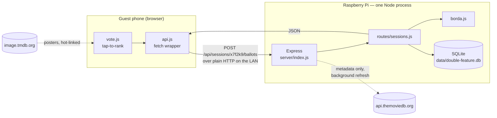
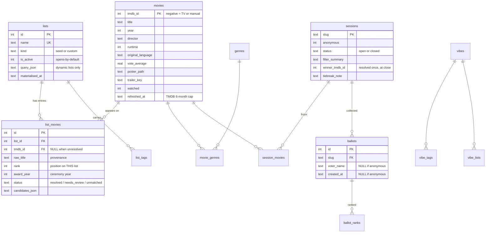
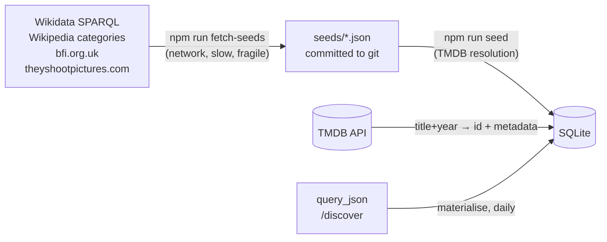

# Architecture

How Double Feature works, end to end. Written for someone who directs this
project but doesn't write web applications: it assumes you're fluent in SQL,
pipelines and data modelling, and explains the web-specific machinery instead.

Numbers in this document are real, measured against `data/double-feature.db`
on 2026-07-30.

> **Not startup reading, on purpose.** This is a plain-language tour for
> someone who directs this project without writing it, and a public-facing
> description of what it is. It is a dated snapshot and is deliberately NOT
> kept in step with the code — expect counts and file references in it to be
> out of date. `DECISIONS.md` wins for decisions, `ROADMAP.md` for what is
> being built, and the code wins for what the code does.

> **This is a snapshot, not a living document.** Written 2026-07-30, against
> commit `93bf402`. Nothing keeps it in step with the code — unlike
> `ROADMAP.md` and `BACKLOG.md`, which are updated as decisions land and are
> the authority when they disagree with this file. Re-generating it is cheap;
> quietly trusting a stale copy is not. If you are reading this long after that
> date, treat the shapes and reasoning as durable and the specific line
> numbers, counts and file lists as historical.

---

## 1. The one-paragraph version

Double Feature picks tonight's film for a room full of people. A host, on a
laptop or tablet, assembles a **lineup** — a shortlist of five or six films —
by drawing at random from curated lists (Criterion, TSPDT, the Palme d'Or
winners, …), by searching TMDB for a specific title, or by typing one in by
hand. When the lineup looks right the host **publishes** it, which mints a vote
session at an unguessable URL and puts a QR code on screen. Guests scan it with
their phones, tap the films in preference order, and submit. The host's screen
shows a running tally; when they close voting, a Borda count resolves a winner
and the result is written down permanently. That's the loop:

```
curated lists → filter → draw → lineup → publish → QR → ranked ballots → Borda → winner
```

Structurally the app is three things stacked: **an ETL pipeline** that turns
published film lists into a local catalogue keyed on TMDB id, **a small query
layer** over that catalogue (the pool filters), and **a UI** that runs a vote.
The pipeline is by far the largest and most opinionated part; the voting is
about 400 lines.

Everything runs in one Node process on a Raspberry Pi, on one Wi-Fi network,
with no accounts, no authentication and no internet exposure. That constraint
is load-bearing on almost every design decision below.

---

## 2. The shape of the whole thing

### The vocabulary you need

A few web terms that don't map onto data work, defined once:

| Term | What it actually means here |
|---|---|
| **Backend** | The Node process running on the Pi. It owns the SQLite file — it is the only thing that ever opens it. Nothing else can touch the data. |
| **Frontend** | JavaScript that the backend hands to a browser, which then runs *on the phone or laptop*, not on the Pi. It has no database access whatsoever; it can only ask the backend questions over HTTP. |
| **HTTP route** | A named entry point on the backend: a method plus a path, e.g. `POST /api/draw`. Think of it as a stored procedure with a URL. The frontend calls it with a JSON argument and gets JSON back. `server/index.js` is the routing table. |
| **SPA** (single-page app) | The browser loads one HTML file *once* and then rewrites the page in place as you navigate. Clicking "Explore" doesn't fetch a new page from the server; it runs a JS function that empties a `<div>` and rebuilds it. |
| **State** (in a browser) | Variables held in the phone's memory while the page is open. It vanishes on reload. This is why "what's in the lineup right now" is nowhere in SQLite until you publish. |
| **Module** | One `.js` file. Each is imported by name and evaluated exactly once per page load — which is the mechanism the two shared-state singletons rely on (§5). |
| **Polling** | The host screen asks "any new ballots?" every 3.5 seconds, rather than holding a live connection open. See below for why. |

### The request path

A guest's phone on the LAN, from tap to database and back:



Three things worth noticing in that picture:

- **The database is never on the network.** `node:sqlite` opens the file
  directly in-process. There is no database server, no connection string, no
  port. A "query" is a synchronous function call.
- **Posters are the one thing the browser fetches from outside.** They're
  hot-linked from `image.tmdb.org` rather than cached to disk, so the Pi's LAN
  needs internet. Only *metadata* is stored locally.
- **The dotted TMDB arrow is not on the request path.** Drawing a film makes
  zero network calls; every filter is a `WHERE` clause over already-cached
  columns. TMDB is touched only during seeding, imports, and the daily refresh.

### Why polling, not a live connection

The obvious "correct" answer for a live tally is a WebSocket — a connection
held open so the server can push updates. It was deliberately rejected. Six
people on one LAN each submit exactly one ballot; the whole event produces
perhaps a dozen writes. A few seconds of lag on the host's tally is invisible
in a room where someone is still finding the QR code. Polling is a `setInterval`
and one route; a socket layer is a dependency, a reconnection protocol, and
more to keep alive on a Pi.

The polling loops do carry one hard-won detail. Both `views/session.js` and
`views/vote.js` tolerate **four consecutive failures** (~14 seconds) before
giving up. It used to be one — and a single dropped request, a phone waking its
Wi-Fi radio, tore the QR code off the host's screen mid-movie-night with no way
back but a reload.

---

## 3. The folders

| Folder | Contains | Read first |
|---|---|---|
| `server/` | The Node/Express backend: schema, TMDB client, pool query builder, Borda scoring, HTTP routes | `db.js`, `pool.js`, `borda.js` |
| `server/routes/` | One file per resource; each defines the HTTP routes for it | `sessions.js`, `draw.js` |
| `public/` | The frontend, served as static files. No build step — what's on disk is what the browser runs | `pool-state.js`, `lineup.js`, `browse.js` |
| `public/views/` | One file per screen. Each exports a `render…(container)` function | `draw.js`, `vote.js`, `session.js` |
| `scripts/` | Offline ETL. Run by hand, never by the server | `fetch-seed-lists.mjs`, `seed.mjs` |
| `seeds/` | The extracted lists, committed as JSON. The output of `fetch-seed-lists.mjs`, the input to `seed.mjs` | any file — they share one shape |
| `test/` | `node:test` suites, run with `npm test` | `pool.test.js`, `api.test.js` |
| `data/` | The SQLite file (2.3 MB) plus its WAL. Gitignored, bind-mounted in Docker | — |
| `.cache/` | Raw Wikipedia wikitext saved by the fetcher so re-running the parser costs no network | — |

**What actually matters vs what's plumbing:**

The substance is in five files. `server/db.js` holds the entire schema in one
template literal, with the reasoning for each table in comments — it is the best
single document about this project after this one. `server/pool.js` builds the
filter query. `server/borda.js` scores a vote. `public/pool-state.js` and
`public/lineup.js` are the two pieces of shared browser state that make the
tabs cohere.

Plumbing you can mostly ignore: `server/config.js` (a 20-line `.env` reader,
so there's no dotenv dependency), `server/lan.js` (finds the Pi's LAN IP,
preferring Ethernet over Wi-Fi, so the QR code points somewhere real),
`server/slug.js` (six random characters from an alphabet with `0/O` and `1/l/I`
removed, so a slug read off a screen and typed into a phone can't go wrong),
`public/dom.js` (a tiny `h()` element builder — this project uses no framework
at all).

`scripts/backfill.mjs` and `scripts/backfill-list-fields.mjs` are repair tools,
not part of the normal path; §4 explains why they have to exist.

---

## 4. The data

This is the core of the system, so it gets the most room.

### 4.1 The schema



Current contents:

| Table | Rows | Note |
|---|---:|---|
| `movies` | 2,460 | 2 manual, 1 stored as a TV series |
| `lists` | 16 | all seed lists, all active |
| `list_movies` | 3,609 | 3,496 resolved, 94 need review, 19 unmatched |
| `movie_genres` | 5,461 | across 19 genres |
| `list_tags` | 24 | 16 lists carrying 1–3 tags each |
| `vibes` | 4 | the four built-ins |
| `sessions` / `ballots` | 4 / 5 | test data |

The draw pool — distinct films across active lists — is **2,455**. Note that
`list_movies` has 3,609 rows against 2,460 films: **727 films appear on more
than one list** (471 on two, 206 on three, 44 on four, 5 on five, one on
seven). That fan-out is the whole reason the next section matters.

### 4.2 Why the schema is shaped this way

Six decisions here are non-obvious and were made deliberately. They're the
part worth reading twice.

**Identity is the TMDB id, never the title string.** `movies.tmdb_id` is the
primary key, and every list membership joins through it. That's what makes the
727-film overlap collapse correctly: a film on both Criterion and TSPDT is one
row in `movies`, cannot be drawn twice, and can't be double-counted by a
filter. Title matching would have failed on accents, alternate titles, and
leading articles — "The Seventh Seal" vs "Det sjunde inseglet" vs "Seventh
Seal, The". The fuzzy matching happens *once*, at ingest, and the result is
frozen as an id.

**The id space is deliberately overloaded to stay a single global key.** Three
kinds of thing live in `movies.tmdb_id`:

| Range | Meaning | Count |
|---|---|---:|
| positive | a real TMDB movie id | 2,457 |
| negative, above −1,000,000,000 | the **negation** of a TMDB *TV* id | 1 |
| at or below −1,000,000,000 | a synthetic id for a film not on TMDB at all | 2 |

The middle case exists because a handful of works — Godard's *Histoire(s) du
cinéma* is the canonical one — are catalogued by TMDB as TV series, since
that's how they actually aired. TMDB's movie ids and TV ids are independent
counters that can collide, so a TV entry is stored as `-id`. The third case is
the "add it manually" path: a title the host typed that TMDB has never heard
of. Both alternatives — a compound key, or widening the `media_type` CHECK
constraint — would have meant rewriting an already-populated table for a rare
feature. `is_manual` is the real discriminator; `media_type` stays a two-value
column on purpose.

**`rank` lives on the membership, not on the film.** A film is #3 on TSPDT and
unranked on Criterion; rank is a property of *this film on this list*, so it
belongs in `list_movies`. The consequence is the important bit: **`rank IS NULL`
means "this list isn't ranked", not "ranked last"**, so the Top-N filter has to
read `(rank IS NULL OR rank <= ?)`. Getting that wrong would make "draw from the
top 100" silently delete Criterion, Ghibli and every award list from the pool
rather than narrowing the two ranked ones. Only 1,264 of 3,609 memberships
carry a rank.

**`award_year` is stored, not derived.** Tempting to compute it from the release
year — but the offset differs per award. Cannes awards a film in its own
release year; the Oscars and the three national awards run the February after.
Deriving would confidently print the wrong year for half the lists. It's NULL
where the source doesn't record it, and coverage is honestly uneven:

| List | Missing ceremony year |
|---|---|
| Oscar (both) | 0 of 168 |
| Golden Lion | 1 of 66 |
| Palme d'Or | 2 of 82 |
| Golden Bear | 6 of 86 |
| César | 31 of 51 |
| Goya | 29 of 40 |
| BAFTA | 49 of 78 |

The badge just names the award when the year is missing rather than guessing.
`BACKLOG.md` has the plan for filling those in.

**Tags replaced a single `category` column, and the old column is still there.**
A list genuinely belongs in more than one bucket — Ghibli is a *collection*
and *family* and *animation*. Forcing one made the "Cinephile" vibe silently
drop 1,227 Criterion films, because it resolved on `category = 'canon'` alone
and Criterion had been filed as `collection`. `list_tags` fixed it.
`lists.category` was left in place but is **no longer read anywhere** —
dropping it would rewrite the table for nothing, and keeping it as a "primary
tag" would quietly reintroduce the exact problem. The tag vocabulary is fixed
in code (`TAGS` in `server/db.js`) rather than free text, because near-duplicates
(comedy / comedies / funny) would degrade the grouped picker that tags exist to
keep navigable.

**A session freezes its own copy of the films.** `session_movies` stores the
lineup by id at publish time, and `sessions.winner_tmdb_id` is written **once,
at close**. Neither is recomputed. The reason is the tie-break: when two films
tie on points and on 1st-place votes the winner is a coin flip, so recomputing
per request would re-roll it on every poll and every later visit to the History
tab. The result would visibly change each time you looked at it. Freezing the
membership separately also means a film dropping out of a dynamic list later
doesn't corrupt a past vote.

### 4.3 Seed JSON vs the database

They are two distinct stages, and the split is deliberate.



**`seeds/*.json`** is a flat file per list: a name, some tags, provenance
(`source`, `source_url`, `fetched_at`, and often a `note` explaining a
judgement call), and an `entries` array of `{title, year, tmdb_id?, rank?,
award_year?}`. It is **the extracted layer, not the loaded one** — it has no
ids of its own, no resolution status, and is checked into git precisely so a
normal install never touches Wikipedia or the BFI's website. 17 files;
1,251 entries for Criterion, 1,000 for TSPDT, 1,390 for the un-seeded
box-office list.

**The database** is the loaded, resolved, deduplicated layer. The transformation
between them is TMDB resolution, and it is one-way.

There is a live example of the gap right now: `seeds/box-office-france.json`
exists with 1,390 entries, all ranked, all carrying a `tmdb_id` — and the
database has 16 lists, not 17. It's written but not yet loaded
(`ROADMAP.md` §5 has it at 👀 review).

### 4.4 The two scripts

**`scripts/fetch-seed-lists.mjs`** (1,199 lines — the largest file in the
project) is the extract stage. Each list gets its own function because each
source is genuinely different, and the README documents why every one is
sourced where it is. The recurring pattern is Wikidata SPARQL: for the
international awards, `P166 = <award QID>` constrained to `P31 = Q11424` (film
— without that constraint it also returns the *producers*, who receive the award
too), which comes back with a TMDB id already attached for ~100% of rows.

The three national awards can't use that route: Wikidata's coverage of them is
badly incomplete (32 films for BAFTA Best Film against many decades of
ceremonies). So those go **Wikipedia category → Wikidata item → TMDB id**,
which is also how they sidestep localisation entirely — the French page for a
film points at the same Wikidata item as the English one, so no title matching
happens anywhere. `.cache/wiki/` holds the raw wikitext (82 files, one per
year of French box-office data) so iterating on a parser costs no network.

**`scripts/seed.mjs`** is the load stage. For each entry it calls
`resolveEntry()`, which searches TMDB and scores the candidates: exact title
match after normalisation (accents stripped, `&` → "and", leading articles
removed) *plus* a release year within one of what the list says — festival vs
general release routinely differ by a year. Only a confident, unambiguous match
resolves. **Nothing is ever silently dropped**: an unconfident match is written
with `status = 'needs_review'` and its top five candidates in
`candidates_json`, and appears in the Lists tab for manual reconciliation. Two
equally exact matches go to review rather than being resolved on popularity.
That's the 94 + 19 unresolved rows above — 3.1% of memberships, sitting in the
queue rather than lost.

Two properties of `seed.mjs` are worth knowing because they bite:

- **It matches lists by NAME.** Renaming a list in a seed file creates a
  *second* list beside the old one rather than renaming it. That's why
  `renameCrowdPleasers()` exists as a migration in `db.js` instead.
- **It skips entries that already landed** (keyed on `raw_title + raw_year`),
  so re-running is cheap and an interrupted run just continues. The cost:
  a *column* added later can never be filled in by re-seeding, because the rows
  are skipped. That is the entire reason `scripts/backfill-list-fields.mjs`
  exists — it walks existing rows and writes `rank` and `award_year` from the
  seed JSON, making no TMDB calls at all. A fresh install once ended up with
  `rank` NULL everywhere, which silently removed the Top-N control from the UI.

### 4.5 Dynamic lists

One list, *Modern Classics (last 10 years)*, has no fixed membership. Its
`lists.query_json` holds `{kind: 'discover', params: {...}, limit: 120}` and
the membership is re-derived from TMDB's `/discover` endpoint.

The key decision: **the result is materialised into `list_movies` like any
other list**, not resolved at draw time. Downstream — the pool query, the
filters, Top-N, the vibes, the picker — a dynamic list is indistinguishable
from a hand-curated one, with no second code path, and a draw never depends on
the network. Reconciliation is incremental (keep, insert new, delete gone)
rather than wipe-and-rebuild, and a query returning *zero* rows is explicitly
refused as a delete instruction — a transient API hiccup would otherwise empty
a list the host is drawing from.

The query is `sort_by=vote_average.desc&vote_count.gte=5000`, and the floor is
the whole point. TMDB's own `/movie/top_rated` has no floor, which is why it
mixes classics with obscure titles a few enthusiasts inflated; at a floor of
1,000 it still returned *Gabriel's Inferno*. At 5,000 it returns *Top Gun:
Maverick* and *Across the Spider-Verse*. The list was called "Crowd-Pleasers"
until that name was measured against reality: sorting by rating selects for
*acclaim*, and its lowest entry rates 8.2 while the films people actually put
on for a fun evening rate 6.6–7.0. No vote floor reaches them. It was renamed
rather than re-tuned.

### 4.6 The TMDB cache and its refresh

Every column on `movies` except `watched`, `watched_at` and `is_manual` is
cached TMDB data. `refreshed_at` is the cache timestamp.

TMDB's terms cap cached data at six months. `server/refresh.js` runs **a minute
after boot, then daily** — boot is the reliable trigger, because a Pi is
rebooted more often than it stays up for a month — and re-fetches up to 250 rows
per run that are either older than **150 days** (five months, comfortably inside
the cap) or missing a field. `upsertMovie` deliberately never touches `watched`,
so a refresh can't resurrect a film the host crossed off.

The "missing a field" clause carries a measured caveat worth understanding,
because it's a classic data-quality trap. Rows are considered incomplete when
`vote_average IS NULL OR original_title IS NULL` — and `countries`, `languages`
and `trailer_key` are *excluded from that test on purpose*. They're excluded
because TMDB genuinely doesn't have them for some films: `/movie/1578` (Raging
Bull) comes back with an empty `spoken_languages`. Five rows in the library
could therefore never satisfy the predicate. They were re-fetched every single
day, and since the query sorts incomplete rows first they permanently occupied
the head of the 250-row queue. `npm run backfill` reported "5 updated" on every
run without ever converging. The cost of the fix is that a newly added column
self-heals over 150 days instead of one; the alternative was a queue that never
drains.

---

## 5. The frontend

### No build step

`public/` is served as static files, straight off disk. The browser loads
`index.html`, which loads `app.js` as an ES module, which imports the rest.
There is no bundler, no transpiler, no `dist/` — edit a file, reload the page.
The entire dependency list for the project is Express and a QR-code library.

This has one sharp edge, documented in `.claude/CLAUDE.md` as a repeat
offender: **`node --check` passes on a missing import**. It's a syntax check,
so a symbol that's used but never imported sails straight through and only
fails in the browser. The countermeasure is to load every frontend module
under a stubbed DOM after touching them.

### Routing and teardown

`app.js` is 76 lines and does two things. It reads `location.hash` to decide
which of the four host tabs to render, and it checks `location.pathname` for
`/vote/<slug>` to render the guest screen instead. Each view is a function that
receives an empty `<div>` and fills it.

Views that poll return a **teardown function**, which `app.js` calls before
swapping views — otherwise a hidden tab would keep hitting the server forever.

On the server side, the SPA entry points are listed explicitly (`/` and
`/vote/:slug`) rather than with a catch-all, so a mistyped `/api` path returns
a JSON 404 instead of silently returning the app's HTML.

### The views

| File | Screen | What it does |
|---|---|---|
| `views/draw.js` (836 lines) | **Lineup** | The main host screen. Pool setup, vibe chips, filters, draw/replace, TMDB search, manual entry, publish |
| `views/explore.js` | **Explore** | Browse the whole library — same filters and cards, but sorted and paginated instead of a random sample |
| `views/lists.js` (664) | **Lists** | Create lists, import by paste/upload, reconcile unmatched entries, set `is_active` and tags |
| `views/history.js` | **History** | Every published vote, newest first |
| `views/session.js` | *(shared)* | The host's live panel — QR code, tally, close/cancel — **and** the results screen. Reused read-only by History |
| `views/vote.js` | **Guest** | The phone screen: tap to rank, name, submit |
| `browse.js` (680) | *(shared)* | Filter panel, list picker, tag chips, movie card — shared by Draw and Explore so a change is made once |

`views/session.js` being shared between the host and History is a known trap:
it takes an `onClosed` callback that resets the lineup, and **only the caller
that owns the lineup passes it**. Without that gate, opening last week's result
from History would wipe the lineup you're building now.

### The two shared-state singletons

Each view is torn down and rebuilt from scratch on every navigation, so
anything held in a view's own variables is lost the moment you switch tabs.
Two things must survive that, and both use the same mechanism: a module-level
variable in a file that every view imports. ES modules are evaluated exactly
once per page load, so every importer gets the *same* object — the browser
equivalent of a singleton.

**`lineup.js`** — tonight's shortlist. It's an array of film objects, each
tagged with a `source`: `'draw'` if the machine picked it, `'added'` if a human
did (search, paste, manual, or the Explore tab). That distinction is what makes
**"Replace N"** safe: it only swaps out films that were *drawn*, and never
throws away one someone deliberately chose. The lineup is what lets a film added
on Explore still be there when you switch back to Lineup.

**`pool-state.js`** — which lists are in play tonight, the filters over them,
and which vibe (if any) produced that combination. Three decisions in this file:

- **It is deliberately not in the database.** `lists.is_active` means "in play
  by *default* when the app opens" and is written only from the Lists tab.
  What you pick for tonight is ephemeral and must never silently rewrite that
  preference.
- **A list selection is not a filter.** The two used to live in one flat object
  and everything downstream disagreed about whether that was true —
  `clearFilters()` needed a comment apologising for not clearing the lists,
  and `/api/pool/facets` took lists as a query param while its siblings took
  them in the body. That disagreement produced a "N films match" count computed
  from the list selection alone: with Ghibli selected and year ≤ 1990 it read
  23 against a real pool of 5. They're peers now, in the state and on the wire.
- **`applyVibe` deep-copies with `structuredClone`.** A shallow spread would
  make the live filter state *be* the cached vibe object from `/api/vibes` —
  and the filter panel mutates in place. Apply Family, click the Animation
  chip, and Family now permanently means Family-plus-Animation while the chip
  still reads "Family".

A third module, **`prefs.js`**, is the deliberate opposite: display preferences
(currently just "show award badges") that *should* persist, so they live in
`localStorage`. Mixing the two would mean either leaking tonight's lineup into
next week or forgetting a display choice on every navigation.

### The three-state list selection

Worth calling out because it recurs on both sides of the wire. `lists` has
three states, not two:

| Value | Meaning |
|---|---|
| `null` / absent | no selection sent — fall back to `is_active` |
| `[]` | an explicit "nothing selected" — an **empty pool** |
| `[1, 4]` | exactly those lists |

Collapsing the first two would make "the host deselected every list" look
identical to "the client didn't mention lists", and the pool would silently
widen to the entire library at the exact moment the user asked for nothing.
`buildPoolQuery` emits a literal `1 = 0` for the empty case rather than
skipping the clause.

---

## 6. The voting mechanism

### Publish

`POST /api/sessions` takes the lineup's ids plus the pool setup. It validates
every id exists, mints a slug, writes `sessions` + `session_movies`, and stores
a human-readable `filter_summary` ("The Criterion Collection + Palme d'Or ·
1960–1979 · no Horror · top 100") for the results and History screens. The
client sends its own list selection rather than the server reading `is_active`,
which would mislabel any vote where the host picked something different for
tonight.

**Nothing before this point is written down.** A draw is ephemeral by design —
which is why History can only ever show published votes.

### Borda count

With N films: a 1st-place vote is worth N−1 points, 2nd is N−2, down to 0.
Highest total wins.

- **Unranked films score 0**, so a partial ballot still counts. The spec
  assumed full rankings, but a guest who ranks 2 of 5 is otherwise
  unrepresentable and dropping their ballot would be worse than counting the
  preferences they gave.
- **Tie-break 1:** most 1st-place votes.
- **Tie-break 2:** random, and *reported* — the results screen says plainly
  that it was a coin flip. Never silently resolved.

The coin flip is why the winner is written to `sessions.winner_tmdb_id` at
close and read back thereafter (§4.2).

### How a ballot is stored

An ordered array of ids on the phone becomes rows in `ballot_ranks`. Rank is
just position, which is what makes the UI's auto-renumbering fall out for free:
tapping a ranked film again removes it from the array and every rank below
closes up automatically, with no renumbering code anywhere.

The server **renumbers from 1 regardless** of what the client sent, drops ids
that aren't part of the session, and drops duplicates — so a client bug can't
submit gappy or hostile ranks.

There is deliberately **no ballot-stuffing prevention**. Nothing stops someone
voting twice. That's the trusted-friend model, on purpose.

### Anonymity, enforced at write time

This is the design decision most worth understanding, because it's the opposite
of how anonymity is usually implemented.

The normal approach is to store everything and filter on read. Here, when a
session is marked anonymous:

1. `ballots.voter_name` is written **NULL**.
2. `ballots.created_at` is written **NULL** — because a timestamp ordering,
   cross-referenced with who was seen picking up their phone, deanonymises just
   as effectively as a name.
3. The `ballot_ranks` rows are **shuffled** before insert, so insertion order
   within a ballot leaks nothing.
4. The running tally is withheld from the host entirely while an anonymous
   session is open. The host waits like everyone else.

The consequence is that **no later API bug can deanonymise a ballot, and
neither can opening `data/double-feature.db` with a SQL client**. The
information was never written. The results screen says so explicitly rather
than showing an empty ballots table, because "we didn't record this" and "we're
not showing you this" are very different claims.

### Close vs cancel

**Close** computes the winner, writes it, and is permanent for that vote —
another round means building a new lineup. **Cancel** is only valid while open
and deletes the session outright, cascading to `session_movies`, `ballots` and
`ballot_ranks`; it never appears in History. It's for a vote started by
mistake, and it's distinct from closing precisely because closing creates a
permanent historical record.

---

## 7. If you want to change X, look at Y

| You want to… | Go to |
|---|---|
| Add or change a filter (a new facet, different semantics) | `server/pool.js` → `buildPoolQuery`, then `public/browse.js` → `renderFilterPanel` |
| Add a column to `movies` | `server/db.js`: add it to `SCHEMA` *and* an `ensureColumn` line in `migrate()`. Then decide whether it belongs in `INCOMPLETE` in `refresh.js` — read §4.6 first |
| Add a new curated list from a website | A `fetch…()` function in `scripts/fetch-seed-lists.mjs`, emitting `seeds/<name>.json`, then `npm run seed` |
| Add a list you already have as text/CSV | Don't script it — the Lists tab imports paste or upload directly |
| Add a query-backed list | A seed file with a `query` block and no entries; see `seeds/modern-classics.json`. `server/dynamic-lists.js` needs no change |
| Change the tag vocabulary | `TAGS` and `TAG_LABELS` in `server/db.js` — the only place |
| Change scoring or tie-breaks | `server/borda.js` (pure functions, no DB) and `test/borda.test.js` |
| Change what a guest sees | `public/views/vote.js` |
| Change the host's live panel or results screen | `public/views/session.js` — remember History renders through it too |
| Change what a movie card shows | `public/browse.js` → `movieCard`, shared by Draw and Explore |
| Change the polling interval or failure tolerance | `POLL_MS` / `MAX_POLL_FAILURES` in `views/session.js` and `views/vote.js` |
| Add an HTTP route | A file in `server/routes/`, mounted in `server/index.js` |
| Change how titles are matched to TMDB | `server/tmdb.js` → `normalizeTitle` and `scoreCandidate` |
| Fix a column that's NULL on rows seeded before it existed | `scripts/backfill-list-fields.mjs` (from seed JSON) or `scripts/backfill.mjs` (from TMDB) — **not** a re-run of `seed.mjs`, which skips them |
| Understand why something was decided | `ROADMAP.md` §2 for reversals, §4 for shipped v2, §5 for v3; `BACKLOG.md` for the measurements behind them |

### Two traps that have bitten more than once

Both are recorded in `.claude/CLAUDE.md`; repeating them here because neither
is caught by the usual checks.

**A backtick inside a SQL comment terminates the `SCHEMA` string.**
`server/db.js` holds the whole schema in one template literal, so writing
`` `category` `` in a comment ends the string and the file fails to parse with
a confusing error pointing at the SQL. Use plain words in those comments.

**`node --check` passes on a missing import.** After touching frontend modules,
load them all under a stubbed DOM to confirm every import actually resolves —
a syntax check will not catch it, and it only fails in the browser.

And one operational rule: **back up `data/*.db` before a migration.**
`data/double-feature.db.pre-v2` is what that looks like in practice.
